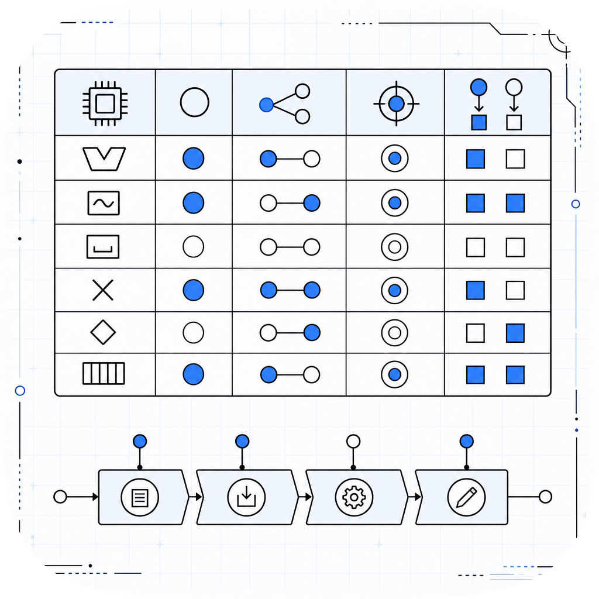

# scoreboarding

<p align="center">
  
</p>

Pure-Python cycle-exact simulator of Thornton's **Scoreboarding** algorithm,
as implemented in the CDC 6600 (1964). Designed for computer architecture
education: readable source, zero runtime dependencies, and per-instruction
cycle-number traces.

> PyPI publish pending (package-upload quota). `pip install scoreboarding`
> will work once the first release is live. Install from source in the meantime.

---

## What is Scoreboarding?

Scoreboarding is an **in-order issue, out-of-order execution** dynamic
scheduling technique. The processor issues instructions one at a time
(program order), but lets them read operands and execute independently once
their hazards clear. A central scoreboard -- three tables -- tracks every
in-flight instruction and enforces the classic CDC 6600 hazard rules without
any register renaming.

### The Four Stages

| Stage | What happens | Hazard checked |
|---|---|---|
| **Issue** | Assign instruction to a free FU | Structural (FU busy) + WAW (another active insn writes same dest) |
| **Read Operands** | Read both source registers | RAW (stall until producing FU has written result) |
| **Execute** | Occupy the FU for its full latency | -- |
| **Write Result** | Commit result to register file, free FU | WAR (stall until every earlier reader has read its operand) |

### Three Tracking Tables

1. **Instruction Status** -- per-instruction cycle stamps (Issue / ReadOperands / ExecuteComplete / WriteResult).
2. **Functional Unit Status** -- per-FU: busy flag, op, destination (Fi), sources (Fj, Fk), producing FUs (Qj, Qk), ready flags (Rj, Rk).
3. **Register Result Status** -- which FU will next write each register (None once written).

### How it differs from Tomasulo

| | Scoreboarding | Tomasulo |
|---|---|---|
| Issue order | In order | In order |
| Execution order | Out of order | Out of order |
| WAW handling | Stall Issue | Register renaming (RS tags) |
| WAR handling | Stall Write Result | Eliminated by renaming |
| RAW handling | Stall Read Operands | Stall in RS until CDB broadcast |
| Register renaming | No | Yes (via reservation stations) |
| Broadcast mechanism | Central scoreboard | Common Data Bus |

See the sibling package [tomasulo](https://github.com/amaar-mc/tomasulo) for the
Tomasulo out-of-order scheduler with register renaming.

---

## Install

```bash
# From source (until PyPI release):
git clone https://github.com/amaar-mc/scoreboarding
cd scoreboarding
uv pip install -e ".[dev]"
```

---

## Usage

### Python API

```python
from scoreboarding import FunctionalUnit, Instruction, run, render_trace

fus = [
    FunctionalUnit(name="Load1", kind="load", latency=2),
    FunctionalUnit(name="Mult1", kind="mult", latency=10),
    FunctionalUnit(name="Add1",  kind="add",  latency=2),
    FunctionalUnit(name="Div1",  kind="div",  latency=40),
]

program = [
    Instruction(op="LD",   dest="F6",  src1="R2", src2=""),
    Instruction(op="LD",   dest="F2",  src1="R3", src2=""),
    Instruction(op="MULT", dest="F0",  src1="F2", src2="F4"),
    Instruction(op="SUB",  dest="F8",  src1="F6", src2="F2"),
    Instruction(op="DIV",  dest="F10", src1="F0", src2="F6"),
    Instruction(op="ADD",  dest="F6",  src1="F8", src2="F2"),
]

trace = run(program, functional_units=fus)
print(render_trace(trace))
```

### Example timing table

```
+---------------------+-------+---------+----------+-------------+
| Instruction         | Issue | ReadOps | ExecComp | WriteResult |
+---------------------+-------+---------+----------+-------------+
| LD F6, R2           |     1 |       1 |        2 |           3 |
| LD F2, R3           |     3 |       3 |        4 |           5 |
| MULT F0, F2, F4     |     4 |       5 |       14 |          15 |
| SUB F8, F6, F2      |     4 |       5 |        6 |           7 |
| DIV F10, F0, F6     |     5 |      15 |       54 |          55 |
| ADD F6, F8, F2      |     8 |       8 |        9 |          16 |
+---------------------+-------+---------+----------+-------------+
Total cycles: 16
```

### CLI

```bash
# Use the bundled example:
scoreboarding examples/classic.txt

# Enable per-cycle snapshots:
scoreboarding --snapshots examples/classic.txt

# Read from stdin:
cat examples/classic.txt | scoreboarding -
```

Program file format:

```
# Comments start with #
FU Load1 load 2
FU Mult1 mult 10
FU Add1  add  2
FU Div1  div  40

LD   F6, R2
LD   F2, R3
MULT F0, F2, F4
SUB  F8, F6, F2
DIV  F10, F0, F6
ADD  F6, F8, F2
```

---

## Development

```bash
uv run pytest -q
uv run ruff check .
uv run mypy src
uv build
```

CI runs on Python 3.10, 3.11, 3.12, 3.13 via GitHub Actions.

---

## License

MIT -- see [LICENSE](LICENSE).
